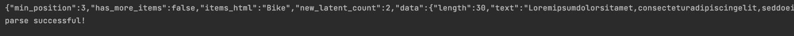

# cppjson
  

这是一个使用C++17开发的JSON库。使用MIT协议。
它支持UTF-8编码格式。

### 如何使用？
cppjson支持从json文件读取数据然后进行解析，详情请见`testexpamle1.json`文件。
如果你使用了`testexample1.json`文件，如`main.cpp`所示，便可以进行解析，得到以下输出结果。

cppjson还支持反序列化操作，即将

### external中的文件
`external`中包含`googletest`和`benchmark`两个文件夹，对你而言可能并没有帮助，因为它仅作为测试编写以及
基准测试而引入，删除`external`并不影响该库的使用。如有需要，可以删除
